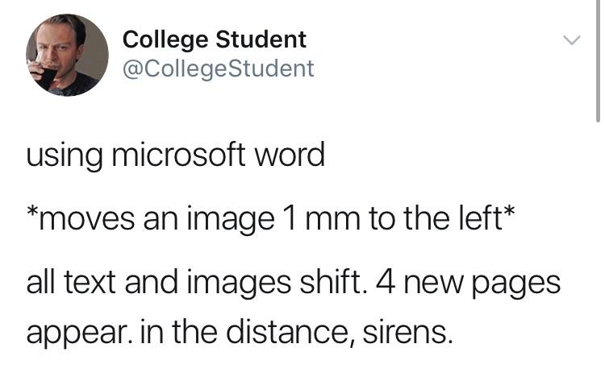
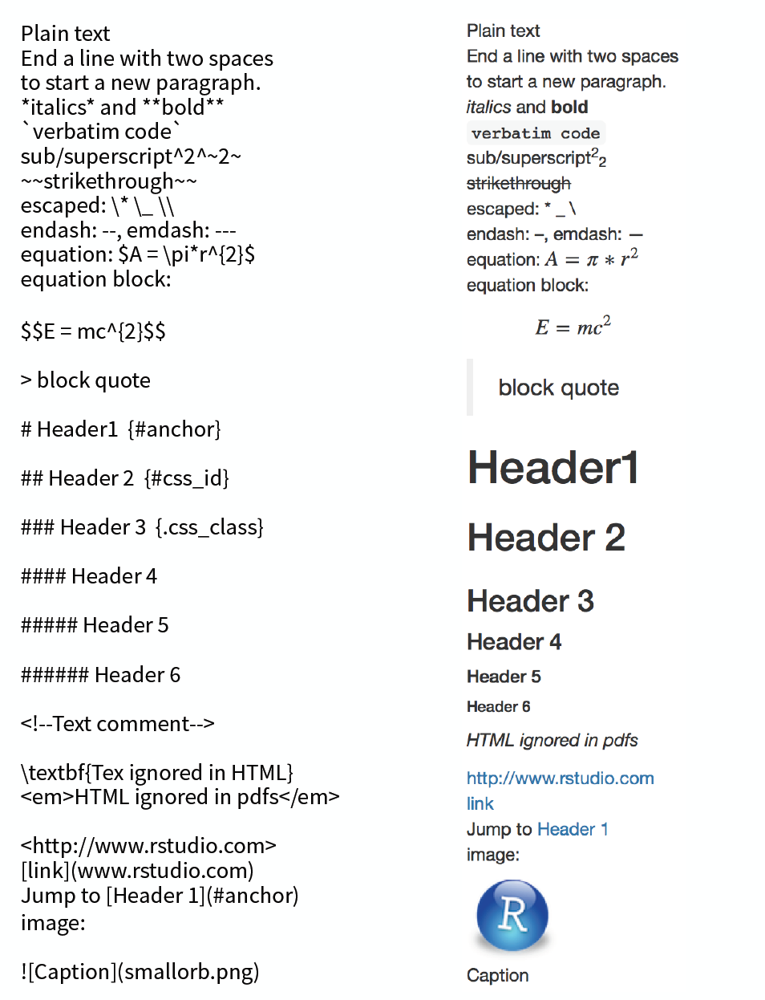
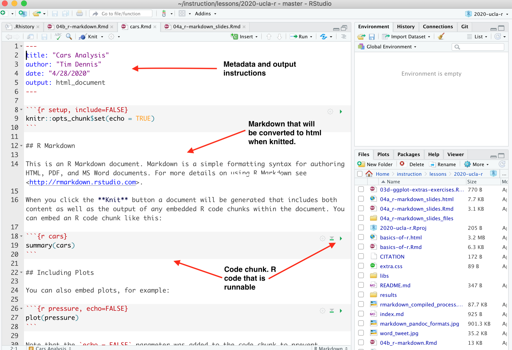
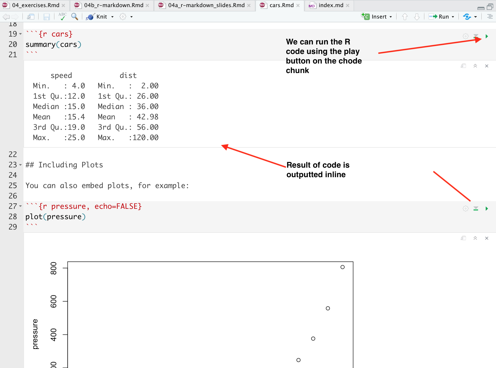
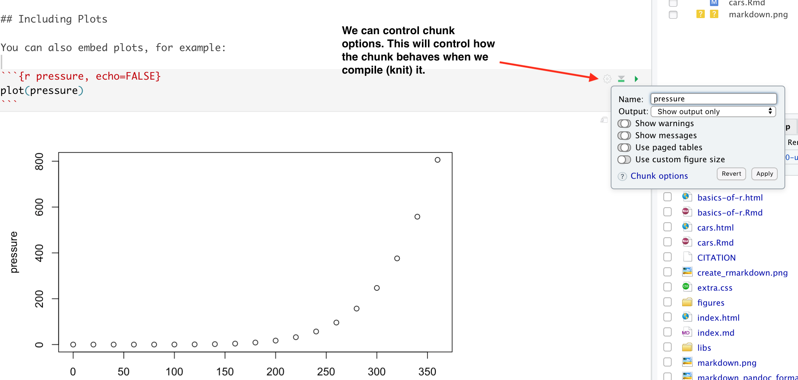
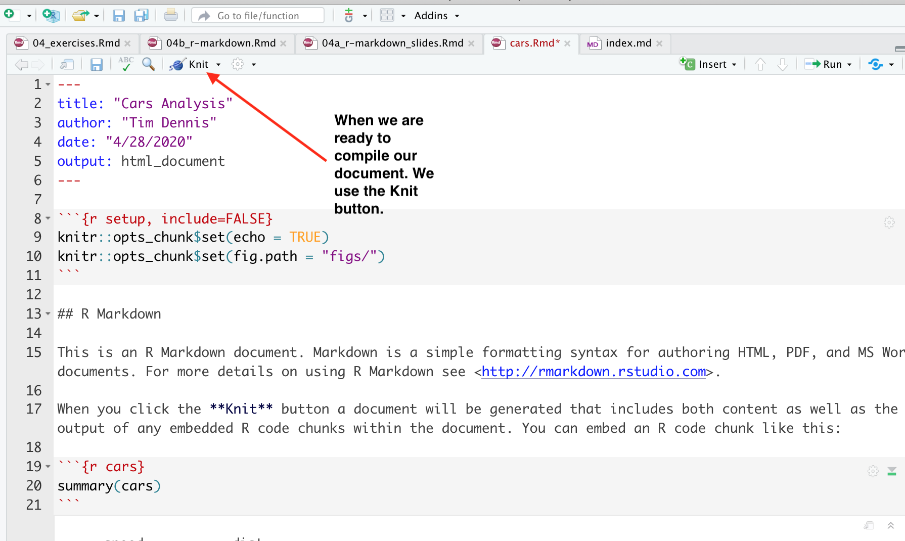
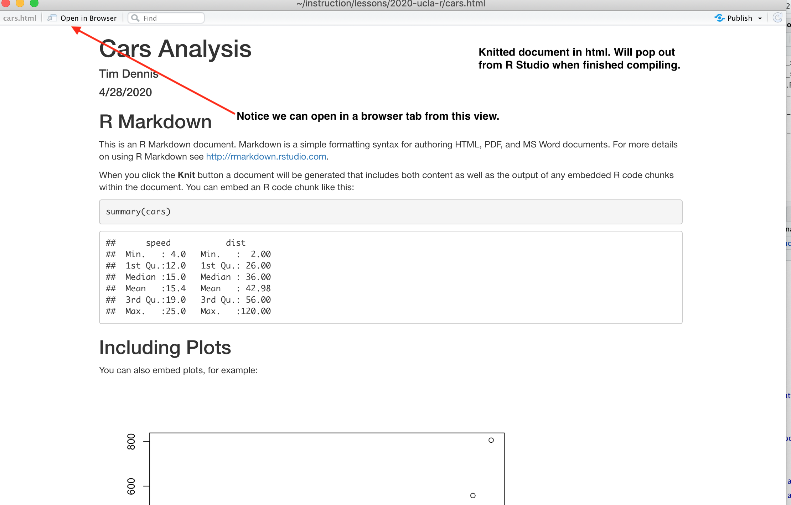

background-image: url(https://github.com/ucla-data-archive/ucla-data-archive.github.io/raw/master/public/images/dsc_logo_blue_background.png)

```{r setup, include=FALSE}
options(htmltools.dir.version = FALSE)
#install.packages('xaringan')
 # need this package for these slides```

---
class: center, middle

# R Markdown

### Tim Dennis & Leigh PHan

---
class: inverse, center, middle

# Objectives 

---

# Today: 

- Understand the value of writing **reproducible reports**
- Recognize and compile the basic components of an R Markdown file
- Use markdown in a R Markdown document
- Write **R code chunks**, and understand their purpose, structure and
  options
- **Knit** a document that contains markdown and R code into html
- Be aware of other **output formats** an R Markdown file can be exported as
- Publish the output of your knitted R Markdown document to **Netlify**

---

# Data analytic papers/reports

* Data analysts write a lot of reports, describing their
analyses and results.
* Writing reports in Word or [LaTeX](http://www.latex-project.org/) can incoporate analysis and ouput graphs together in one doc.
* But tweaking the report and parameters can be difficult.
* Having the code, analysis and output in one document that is **runable** helps with this
* Makes changing formatting or analysis much easier to maintain and recreate. 

???

* Beginners often write R scripts & email those scripts & graphs around.
* This can be problematic and cumbersome 
* have to fix or change code, run it, get output and copy over to document
* will have to do this multiple times as you tweak, gets confusing, prone to error

---

# Literate programming

* Ideally analytical reports should be _reproducible_ documents 
* Key R package is [`knitr`](http://yihui.name/knitr/). 
* When the document is processed by `knitr`, chunks of code will
be executed, and graphs or other results inserted into the final document.

???
* Repro Docs: If an error is discovered, or if some additional observations are added to the data, you can re-compile the report and get the new or corrected
results. 
* Knitr: lets you to create a document that is a mixture of text and chunks of
code. 

---



---

### Getting the analysis right is only one link

Process, packaging, and presentation are often the weak links in the chain. 


---

# R & Markdown 

* Today, we'll use `R Markdown` that primarily mixes Markdown
with R - though you can use Python, SQL or other languages in R Markdown.
* [Markdown](https://www.markdownguide.org/) is a light-weight mark-up language for creating web pages (the name is a play on the word [markup](https://en.wikipedia.org/wiki/Markup_language) where you annotate a document with info to display text, e.g. html tags)

---

class: inverse, center, middle

# Markdown

---

## What is Markdown?

* Markdown is a particular type of markup language. Markup languages are designed to produce documents from plain text.
* You may be familiar with LaTeX, another (though less human friendly) text markup language.
* Tools render markdown to different formats (for example, HTML/pdf/Word).
  * The main tool for rendering Markdown is `pandoc`.

---

# Markdown

* **Markdown** Easy to write and read in an editor.
* **HTML** Easy to publish and read on web.
* Uses symbols like asterick, pound, underscore to mark up text 
* The marked-up text gets _converted_ to html (or other formats), replacing the marks with the proper html code/formatting.

---

#### What it looks like: 


---

### Markdown can be rendered to multiple formats using pandoc


---

class: inverse, center, middle

# R Markdown

---

## R Markdown

R Markdown is rendered to Markdown. The strength of R Markdown, is that with an easy syntax, it is possible to mix ideas, code, and generated results seamlessly.

---

#### What this looks like. 



---

### We can play code inline




---

### Chunk options



---

### Knit the document



---

### Knitted document



--- 

## What we will do: 

* Create a R Markdown document
* Add some markdown 
* Add code chunks 
* Compile document
* Pubulish on web! 