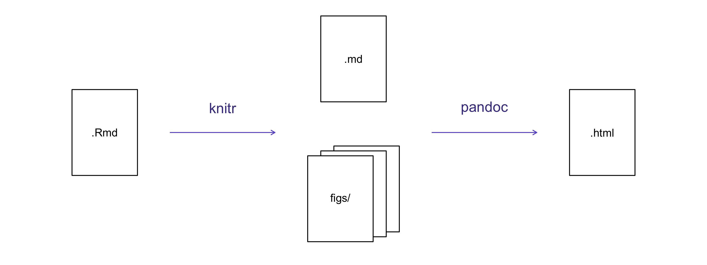

## Data analysis reports

* Data analysts write a lot of reports, describing their
analyses and results.
* Beginners often write R scripts & email those scripts & graphs around.
* This can be problematic and cumbersome 
* Writing reports in Word or [LaTeX](http://www.latex-project.org/) can incoporate analysis and ouput graphs together in one doc.
* But tweaking the report and parameters can be difficult:
  * have to fix or change code, run it, get output and copy over to document
  * will have to do this multiple times as you tweak, gets confusing, prone to error
* Having the code, analysis and output in one document that is **runable** helps with this
* Makes changing formatting or analysis much easier to maintain
* Also, easier to re-run with changes (no copying and pasting to word or other typesetting systems)

## Literate programming

* Ideally analytical reports are _reproducible_ documents 
  * If an error is discovered, or if some additional observations are added to the
data, you can re-compile the report and get the new or corrected
results. 
* Key R package is [`knitr`](http://yihui.name/knitr/). 
   * It lets you to create a document that is a mixture of text and chunks of
code. 
* When the document is processed by `knitr`, chunks of code will
be executed, and graphs or other results inserted into the final document.
* This sort of idea has been called **literate programming**.
* `knitr` lets you to mix basically any sort of text with code from different programming languages 
* We'll use `R Markdown` that primarily mixes Markdown
with R - though you can use Python, SQL or other languages in R Markdown.
* [Markdown](https://www.markdownguide.org/) is a light-weight mark-up language for creating web pages (the name is a play on the word [markup](https://en.wikipedia.org/wiki/Markup_language) where you annotate a document with info to display text, e.g. html tags)

### Start here after slides: 

## Creating an R Markdown file

* Within RStudio, click <kbd>File</kbd> <kbd>New File</kbd> <kbd>R Markdown</kbd>
* You can stick with the default (HTML output), but add a title and yourself as the author.


## Basic components of R Markdown

* The initial chunk of text (header) contains instructions for R to specify what kind of document will be created, and the options chosen.
* You can use the header to give your document a title, author, date, and tell it that you're going to want to produce html output (in other words, a web page).

```
---
title: "Initial R Markdown document"
author: "Tim DEnnis"
date: "May 1, 2020"
output: html_document
---
```

* Fields are optional - you can delete the ones you don't want
* Double quotes optional needed if you include colon
* for date we can run a inline R function `r Sys.Date()`
* RStudio creates the document with some example text to get you
started. 
* Note below that there are chunks like

```{r cars-example-code}
summary(cars)
```

* This is a code chunk that will be run by `knitr` and output the results inline. 
* We can run it using the play button.

## Markdown

* A system for writing web pages by marking up the text with symbols like asterick, pound, underscore 
* The marked-up text gets _converted_ to html, replacing the marks with the proper html code.


* Let's see how this works:

1. delete all of the dummy text that was generated when we created the rmarkdown document and write some markdown. 
2. make things **bold** using two asterisks around what you want to bold, like this: `**bold**`, and you make things _italics_ by using underscores, like this:
`_italics_`.
3. You can make a bulleted list by writing a list with hyphens or asterisks, like this:


* bold with double-asterisks
* italics with underscores
* code-type font with backticks

dashes also work: 

- bold with double-asterisks
- italics with underscores
- code-type font with backticks

**Each will appear as:**

- bold with double-asterisks
- italics with underscores
- code-type font with backticks

Knit doc. you will need to reshare to capture that window. 

* You can use whatever method you prefer, but *be consistent*. This maintains the readability of your code.
* You can make a **numbered list** by just using numbers.
* You can even use the same number over and over if you want:

1. bold with double-asterisks
1. italics with underscores
1. code-type font with backticks

* Make section headers of different sizes by putting `#` symbols in front of the text, like so: 

```
# Title
## Main section
### Sub-section
#### Sub-sub section
```


* _compile_ the R Markdown document to html by clicking <kbd>Knit</kbd> button in the upper-left.
* You might have to install some packages, hit ok and let RStudio install packages. 


## A bit more Markdown

* You can make a hyperlink like this: `[text to show](http://the-web-page.com)`.
* You can include an image file like this: ``
* You can do subscripts (e.g., F~2~) with `F~2~` and superscripts (e.g.,
F^2^) with `F^2^`.

* If you know how to write equations in
[LaTeX](http://www.latex-project.org/), you can use `$ $` and `$$ $$` to insert math equations, like
`$E = mc^2$` and

```
$$y = \mu + \sum_{i=1}^p \beta_i x_i + \epsilon$$
```

* You can review Markdown syntax by navigating to the
"Markdown Quick Reference" under the "Help" field in the 
toolbar at the top of RStudio.

## R code chunks

The real power of Markdown comes from
mixing markdown with chunks of code. This is R Markdown. When
processed, the R code will be executed; if they produce figures, the
figures will be inserted in the final document.

* The main code chunks look like this:

```{r load_data, eval=FALSE}
gapminder <- read_csv("gapminder.csv")
```

* That is, you place a chunk of R code between <code>&#96;&#96;&#96;{r chunk_name}</code>
and <code>&#96;&#96;&#96;</code>. 
* You should give each chunk a unique name, as they will help you to fix errors and, if any graphs are produced, the file names are based on the name of the code chunk that
produced them.

## How things get compiled

* When you press the "Knit" button, the R Markdown document is
processed by [`knitr`](http://yihui.name/knitr) and a plain Markdown
document is produced (as well as, potentially, a set of figure files): the R code is executed
and replaced by both the input and the output; if figures are
produced, links to those figures are included.
* The Markdown and figure documents are then processed by the tool
[`pandoc`](http://pandoc.org/), which converts the Markdown file into an
html file, with the figures embedded.



* Ok now let's try some challenges in breakout rooms 

## Breakout Room 1 

> ## Challenge 1
>
> 1. Create a new R Markdown document. Delete all of the R code chunks
> 2. Make a header (H2) using markdown with your name, hint, `##`
> 3. On the next line, make a bullet point and add your department
> 4. Add another bullet point and provide a link to your department or workplace
> 5. After the bullets, write a bit about your research area or what you might like to do in R. 
>
> Convert the document to a webpage.

> ## Challenge 2
>
> To the document you created in Challenge 1, add a code chunk, by selecting <kbd>Insert</kbd> and <kbd>R</kbd>. You can copy the below code chunk and then fill in the blanks. 
> * Load the ggplot2 package
> * Read the gapminder data
> * Create a plot
> * Change eval=FALSE to eval=TRUE - this tells knit to either run or not run code. 
> * See if you can figure out how to do this via the gear control near the play button 
> * Knit the document

```{r challenge-2, eval=FALSE}
library(______)
library(______)
ggplot(gapminder, aes()) +
  geom_____()
```

> ## Challenge 3
>
> 1. Now create a new R Markdown document, but this time select "Presentation" and "HTML ioslides" option
> 2. Review how the slides are structured. `##` creates a new slide
> 3. Add some of your text from challenge 1 too slides. 
> 4. Add an image to a slide. 
> 5. Knit & share your screen with your breakout partners.
>

## Chunk options

*Options that affect how our code chunks are treated. Examples:

- Use `echo=FALSE` to avoid having the code itself shown.
- Use `results="hide"` to avoid having any results printed.
- Use `eval=FALSE` to have the code shown but not evaluated.
- Use `warning=FALSE` and `message=FALSE` to hide any warnings or
  messages produced.
- Use `fig.height` and `fig.width` to control the size of the figures
  produced (in inches).

Write:

```{r load_libraries, echo=FALSE, message=FALSE}
library("dplyr")
library("ggplot2")
```

* Often there will be particular options that you'll want to use
repeatedly; for this, you can set _global_ chunk options, like so:

```{r global_options, echo=FALSE}
knitr::opts_chunk$set(fig.path="Figs/", message=FALSE, warning=FALSE,
                      echo=FALSE, results="hide", fig.width=11)
```

* `fig.path` option defines where the figures will be saved.
* `/` here is really important; without it, the figures would be saved in
the standard place but just with names that begin with `Figs`.
* If you have multiple R Markdown files in a common directory, you might
want to use `fig.path` to define separate prefixes for the figure file
names, like `fig.path="Figs/cleaning-"` and `fig.path="Figs/analysis-"`.
* You can review all of the `R` chunk options by navigating to
the "R Markdown Cheat Sheet" under the "Cheatsheets" section 
of the "Help" field in the toolbar at the top of RStudio.


## Inline R code

* You can make _every_ number in your report reproducible. 
* Use <code>&#96;r</code> and <code>&#96;</code> for an in-line code chunk,
like so: <code>&#96;r round(some_value, 2)&#96;</code>. 
* The code will be executed and replaced with the _value_ of the result.
* Don't let these in-line chunks get split across lines.

* Perhaps precede the paragraph with a larger code chunk that does
calculations and defines variables, with `include=FALSE` for that larger
chunk (which is the same as `echo=FALSE` and `results="hide"`).

* Rounding can produce differences in output in such situations. You may want
`2.0`, but `round(2.03, 1)` will give just `2`.
* The
[`myround`](https://github.com/kbroman/broman/blob/master/R/myround.R)
function in the [R/broman](https://github.com/kbroman/broman) package handles
this.

## breakout 2 
> ## Challenge 4
>
> Try out a bit of in-line R code.
> 
> > ## Solution to Challenge 4
> > 
> > Here's some inline code to determine that 2 + 2 = `` `r
> > 2+2` ``.
> > 
> {: .solution}
{: .challenge}


> ## Challenge 3
>
> Use chunk options to control the size of a figure and to hide the
> code.
> 
> > ## Solution to Challenge 3
> > 
> > <pre>
> > &#96;&#96;&#96;{r echo = FALSE, fig.width = 3}
> > plot(faithful)
> > &#96;&#96;&#96;
> > </pre>
> > 
> {: .solution}
{: .challenge}

## Other output options

* You can also convert R Markdown to a PDF or a Word document. 
* Click the little triangle next to the "Knit" button to get a drop-down
menu.
* Or you could put `pdf_document` or `word_document` in the initial header
of the file.

> ## Tip: Creating PDF documents
>
> Creating .pdf documents may require installation of some extra software. If
> required this is detailed in an error message.
>
> - [TeX installers for Windows](https://miktex.org/2.9/setup).
> - [TeX installers for macOS](https://tug.org/mactex).
{: .callout}


## Resources

* [Knitr in a knutshell tutorial](http://kbroman.org/knitr_knutshell)
* [Dynamic Documents with R and knitr](http://www.amazon.com/exec/obidos/ASIN/1482203537/7210-20) (book)
* [R Markdown documentation](http://rmarkdown.rstudio.com)
* [R Markdown cheat sheet](https://www.rstudio.com/wp-content/uploads/2016/03/rmarkdown-cheatsheet-2.0.pdf)
* [Getting started with R Markdown](https://www.rstudio.com/resources/webinars/getting-started-with-r-markdown/)
* [R Markdown: The Definitive Guide](https://bookdown.org/yihui/rmarkdown/) (book by Rstudio team)
* [Reproducible Reporting](https://www.rstudio.com/resources/webinars/reproducible-reporting/)
* [The Ecosystem of R Markdown](https://www.rstudio.com/resources/webinars/the-ecosystem-of-r-markdown/)
* [Introducing Bookdown](https://www.rstudio.com/resources/webinars/introducing-bookdown/)
* [R Markdown Tutorial for RLadies LA](https://github.com/aktilot/rmarkdown-tutorial)
* [Sharing on Short Notice](https://resources.rstudio.com/webinars/sharing-on-short-notice-how-to-get-your-materials-online-with-r-markdown) - RStudio webinar on sharing R Markdown files as websites geared at instructors.

